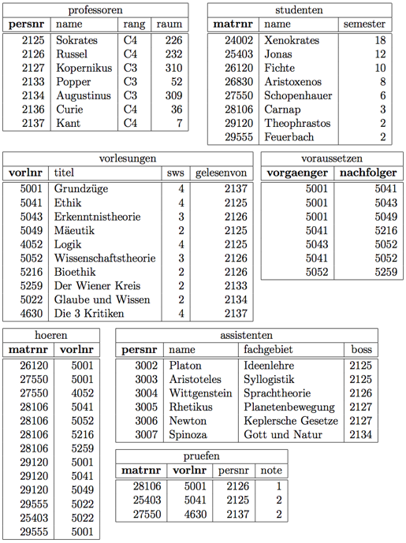

This repository stores some SQL queries that I wrote for some homework that I came across in the university course of Fundamentals of Databases.
The tum [Hyper](https://hyper-db.de/interface.html) data base is what I often used for practicing and testing my sql queries, which is also recommend by our professor. He also recommends the new DBMS [Umbra](https://umbra.db.in.tum.de/interface/).

#### University schema is as follows:

This is used for the majority of our homework tasks. The data is already available in Hyper and Umbra.
