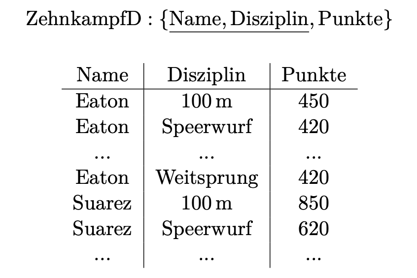

#### Hausaufgabe 1
Folgender Ausdruck im Tupelkalkül gibt alle Studenten aus, die alle von ihnen gehörten Vorlesungen bestanden haben.

{s | s ∈ Studenten ∧ ∀h ∈ hoeren(h.MatrNr = s.MatrNr ⇒  ∃p ∈ pruefen(p.MatrNr = s.MatrNr ∧ p.VorlNr = h.VorlNr ∧ p.Note ≤ 4))}

Übersetzen Sie diese Anfrage nun in SQL. Da SQL keine Allquantoren und Implikationen unterstützt, müssen Sie sie dazu zunächst umformen.

1.1 Formen Sie den Ausdruck in einen Äquivalenten um, der keine Implikationen oder Allquantoren verwendet.

**Elimination ∀:**

{s | s ∈ Studenten ∧ ¬ (∃h ∈ hoeren ¬(h.MatrNr = s.MatrNr ⇒  ∃p ∈ pruefen(p.MatrNr = s.MatrNr ∧ p.VorlNr = h.VorlNr ∧ p.Note ≤ 4))}

**Elimination ⇒:**

{s | s ∈ Studenten ∧ ¬ (∃h ∈ hoeren ¬(¬ (h.MatrNr = s.MatrNr ) ∨ ∃p ∈ pruefen(p.MatrNr = s.MatrNr ∧ p.VorlNr = h.VorlNr ∧ p.Note ≤ 4))}

{s | s ∈ Studenten ∧ ¬ (∃h ∈ hoeren (h.MatrNr = s.MatrNr  ∧ ¬( ∃p ∈ pruefen(p.MatrNr = s.MatrNr ∧ p.VorlNr = h.VorlNr ∧ p.Note ≤ 4)))}

##### 1.2 Übersetzen Sie den so erlangten Ausdruck in SQL. Testen Sie ihn in der Webschnitt- stelle.
```sql
select * from studenten s
where not exists(
select * from hoeren h 
where s.matrnr = h.matrnr and not exists(
select * from pruefen p
where p.matrnr = s.matrnr 
    and p.vorlnr=h.vorlnr 
    and p.note<=4.0)
);

-- count
select * from studenten s
where (
    select count(*) from hoeren h
    where s.matrnr=h.matrnr
    )=
    (
    select count(*) from hoeren h, pruefen p
    where s.matrnr=h.matrnr 
     and h.vorlnr=p.vorlnr
     and s.matrnr=p.matrnr 
     and p.note<=4.0
    );
```

#### Hausaufgabe 2
Gegeben sei ein erweitertes Universitätsschema mit den folgenden zusätzlichen Relationen *StudentenGF* und *ProfessorenF*:

StudentenGF  :  {[MatrNr : integer, Name : varchar(20), Semester : integer, Geschlecht : char, Fakultaet : varchar(20)]}
ProfessorenF  :  {[PersNr : integer, Name : varchar(20), Rang : char(2), Raum : integer, Fakultaet : varchar(20)]}

Die erweiterten Tabellen sind auch in der Webschnittstelle angelegt.

Ermitteln Sie in SQL die Studenten, die alle Vorlesungen ihrer Fakultät hören. Geben Sie zwei Lösungen an, höchstens eine davon darf auf Abzählen basieren.
```sql
-- 学院的所有课的数量 = 学生在该学院听的课的数量
-- 等号前后的内容交换顺序会导致答案的顺序不一样：
select * from studentenGF s
where (select count(*) from vorlesungen v, professorenF p
       where v.gelesenvon=p.persnr and s.fakultaet = p.fakultaet) 
        = 
      (select count(*) from hoeren h, vorlesungen v, professorenF p
       where s.matrnr=h.matrnr and h.vorlnr=v.vorlnr 
	    and v.gelesenvon=p.persnr and s.fakultaet = p.fakultaet);

-- 学生把本学院的课都听了 = 学生，对于这种学生来说，不存在学院的某门课他没听过的
select * from studentenGF s
where not exists (
select * from vorlesungen v, professorenF p
where s.fakultaet = p.fakultaet 
    and v.gelesenvon=p.persnr 
    and not exists(
        select * from hoeren h 
        where v.vorlnr=h.vorlnr 
        and s.matrnr=h.matrnr)
);
```
#### Hausaufgabe 3
Gegeben sei die folgende Relation ZehnkampfD mit Athletennamen und den von ihnen erreichten Punkten in den jeweiligen Zehnkampfdisziplinen: 十项全能运动项目



Finden Sie alle ZehnkämpferInnen, die in allen Disziplinen besser sind als der Athlet mit dem Namen Bolt. Formulieren Sie die Anfrage in SQL

3.1 mit korrelierter Unteranfrage

3.2 basierend auf Zählen 

Sie dürfen davon ausgehen, dass jeder Sportler in jeder Disziplin angetreten ist. Laden Sie zum Testen entweder die SQL-Datei von der Übungswebseite in ein lokal installiertes Datenbanksystem oder verwenden Sie die Webschnittstelle.

```sql
-- 3.1
--  alle disziplinen besser als bolt ⟺ 
--  ¬(mindesten eine disziplin nicht besser als bolt)
select distinct z1.name 
from zehnkampfd z1
where not exists(
    select * from zehnkampfd z2 
    where z1.name=z2.name and exists(
        select * from zehnkampfd z3 
        where z3.name='Bolt' 
        and z3.disziplin=z2.disziplin
        and z2.punkte <= z3.punkte)
);
-- alternative:
-- ¬（Die Note einer bestimmten Disziplin ist nicht besser als die von Bolt）
-- = ¬(Für diese Disziplin nicht existiert bessere Note als Bolt)
select distinct z1.name 
from zehnkampfd z1
where not exists(
    select * from zehnkampfd z2 
    where z1.name=z2.name
    and not exists(
        select * from zehnkampfd z3 
        where z3.name='Bolt' 
        and z3.disziplin=z2.disziplin
        and z2.punkte > z3.punkte)
);

```
3.2 basierend auf Zählen
```sql
select distinct z.name 
from Zehnkampfd z
where (select count(distinct disziplin) from Zehnkampfd) = 
       (select count(z2.disziplin) 
        from zehnkampfd z2, zehnkampfD z3
        where z2.name=z.name 
        and z2.disziplin=z3.disziplin 
        and z2.punkte>z3.punkte 
        and z3.name='Bolt');
        
-- Alternative:
with Better as (
  select z1.name, count(*) as betterThanBolt 
  from zehnkampfd z1, zehnkampfd z2 
  where z1.disziplin = z2.disziplin 
  and z1.punkte > z2.punkte and z2.name = 'Bolt'
  group by z1.name
)
select distinct name from Better b
where b.betterThanBolt = (select count(distinct disziplin) from Zehnkampfd);
```
#### Hausaufgabe 4
*Hinweis: Diese Aufgabe wurde erstellt, bevor eine Impfung gegen COVID-19 möglich war. Deswegen werden hier ausschließlich Tests und persönliche Kontakte betrachtet.* Verwenden Sie für diese Aufgabe das **Infektionsschema**. Sie finden die Schemadefinition und eine Beispielausprägung [here](https://github.com/Fansadventure/SQL_exercises/blob/master/images/Infektionschema.pdf).

In dieser Aufgabe sollen Sie ermitteln, bei welchen ungetesteten Personen ein Virustest **unnötig** ist. Ein Test für Person X ist dann unnötig, wenn:

- X noch nicht getestet wurde und
- in **allen** sozialen Gruppen, in denen X Mitglied ist, keine bestätigte Infektion vorliegt, also alle Gruppenmitglieder entweder ungetestet sind oder negativ getestet wurden.

Beachten Sie, dass eine Person auch Mitglied mehrerer Gruppen oder keiner Gruppe sein kann. Geben Sie PersonId und Name aus. Hier finden Sie das erwartete Ergebnis für die Beispielausprägung. Ihre Anfrage muss natürlich auch dann funktionieren, wenn die Ausprägung der Relationen anders ist als die Beispielausprägung.

```sql
select p.personid, p.name from person p
where p.personid not in (select personid from virentest)
and not exists (
    select * from mitgliedin m
    where p.personid = m.personid and exists(
        select * from mitglied m2, virentest v
        where m.gruppeid=m2.gruppeid 
        and v.personid = m2.personid 
        and v.testergebnis='positiv'
);
-- Alternative:
select p.personid, p.name from person p
where p.personid not in (select personid from virentest)
and not exists(
    select * from mitgliedin m, virentest v, mitgliedin x
    where (p.personid=m.personid) 
    and m.gruppeid=x.gruppeid 
    and v.personid=x.personid 
    and v.testergebnis='positive'
);
```
#### Hausaufgabe 5
Finden Sie die Studenten, die alle Vorlesungen gehört haben.
```sql
-- count(vorlesungen) = count(vorlesungen gehoert)
select * from studenten s
where (select count(*) from vorlesungen v)=
	    (select count(*) from hoeren h where s.matrnr=h.matrnr)
-- 反面法/对立面法：not exists(mindesten eine vorlesung nicht gehoert)
select * from studenten s
where not exists(
  select * from vorlesungen v
  where not exists(
    select * from hoeren h
    where v.vorlnr=h.vorlnr and s.matrnr=h.matrnr)
  )
-- 集合的角度：听的课的集合(hoeren)与课的集合相等(vorlesungen), 所以不存在某个课不在听的课的集合中
select * from studenten s
where not exists(
  select vorlnr from vorlesungen
  where vorlnr not in(
    select vorlnr from hoeren h
    where s.matrnr=h.matrnr)
  )
```
#### Hausaufgabe 6
Finden Sie die Studenten, die alle Vorlesungen von Professor Sokrates gehört haben.
```sql
--count
select * from studenten s
where (select count(*) from vorlesungen v, professoren p
      where v.gelesenvon=p.persnr and p.name='Sokrates') =
      (select count(*) from hoeren h, vorlesungen v, professoren p
      where s.matrnr=h.matrnr and h.vorlnr=v.vorlnr 
       and v.gelesenvon=p.persnr and p.name='Sokrates');
-- opposite
select * from studenten s
where not exists(
  select * from vorlesungen v, professoren p
  where v.gelesenvon=p.persnr and p.name='Sokrates'
  and not exists(
          select * from hoeren h
          where s.matrnr=h.matrnr and h.vorlnr=v.vorlnr
  )
  );
-- menge
select * from studenten s
where not exists(
        select * from vorlesungen v, professoren p
        where v.gelesenvon=p.persnr and p.name='Sokrates'
        and v.vorlnr not in(
                select vorlnr from hoeren h
                where s.matrnr=h.matrnr
        )
);
```
