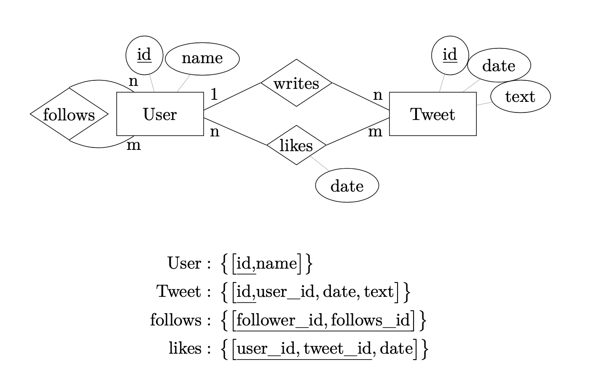

#### Hausaufgabe 1 Integritätsbedingungen
Gegeben sei folgendes ER-Diagramm, das User, deren Tweets, Likes und Follows modelliert, und das dazugehörige relationale Schema:



1.1 Geben Sie SQL-Statements zum Erzeugen der Relationen an. Überlegen Sie sich dazu sinnvolle Typen für die Attribute. Verwenden Sie Angaben zu NULL und Schlüsseln (primary key, unique).

```sql
create table Twitter_User (
    id integer not null primary key,
    name varchar(50) not null unique
);
create table Tweet (
    id integer not null primary key,
    user_id integer not null references Twitter_User,
    tweet_date timestamp not null,
    tweet_text varchar(500) not null
);
create table follows (
    follower_id integer not null references Twitter_User, 
    follows_id integer not null references Twitter_User, 
    primary key (follower_id, follows_id)
);
create table likes (
    user_id integer not null references Twitter_User, 
    tweet_id integer not null references Tweet, 
    like_date timestamp not null,
    primary key (user_id, tweet_id)
);
```
1.2 Ergänzen Sie die SQL-Statements mit referentiellen Integritätsbedingungen. Es soll sichergestellt werden, dass wenn ein User gelöscht wird, auch alle seine Follows, Follower und Likes gelöscht werden. Seine Tweets sollen aber erhalten bleiben, indem die user_id seiner Tweets auf NULL gesetzt wird. Wenn ein Tweet gelöscht wird, sollen ebenfalls dessen Likes gelöscht werden.

```sql
create table Twitter_User (
	id integer not null primary key,
	name varchar(50) not null unique 
);

create table Tweet (
	id integer not null primary key,
	user_id integer null references Twitter_User on delete set null, 
	tweet_date timestamp not null,
	tweet_text varchar(500) not null
);

create table follows (
	follower_id integer not null references Twitter_User on delete cascade, 
	follows_id integer not null references Twitter_User on delete cascade, 
	primary key (follower_id, follows_id)
);

create table likes (
	user_id integer not null references Twitter_User on delete cascade, 
	tweet_id integer not null references Tweet on delete cascade, 
	like_date timestamp not null,
	primary key (user_id, tweet_id)
);
```

1.3 Fügen Sie statische Integritätsbedingungen hinzu, die folgende Eigenschaften garantieren:
- Wenn die user_id eines Tweets NULL ist, muss der Text des Tweets „removed“ lauten
- Das Datum eines Likes darf nicht vor dem Datum des Tweets liegen.

```sql
create table Tweet (
    id integer not null primary key,
    user_id integer null references Twitter_User on delete set null, 
    tweet_date timestamp not null,
    tweet_text varchar(500) not null,
    check (user_id is not null or tweet_text = 'removed')
    --这里的逻辑是： A --> B 等价于 not A or B
    -- (user_id is null --> text='removed') <==> (user_id is not null or text='removed')
);

create table likes (
    user_id integer not null references Twitter_User on delete cascade, 
    tweet_id integer not null references Tweet on delete cascade, 
    like_date timestamp not null,
    primary key (user_id, tweet_id),
    check (exists (
        select * from Tweet t 
        where t.id = tweet_id 
        and t.tweet_date <= like_date 
		))
);
```

#### Hausaufgabe 2 Änderungen am Datenbestand
Führen Sie die folgenden Änderungen am Datenbestand des bekannten Universitätsschemas in SQL aus. Stellen Sie sicher, dass Ihre SQL-Statements mit jeder beliebigen Ausprägung des Schemas funktionieren.

2.1 Alle Professoren, die den Rang C3 haben, werden auf den Rang C4 befördert. Setzen Sie dazu den Rang aller C3-Professoren auf C4.
```sql
update Professoren set Rang = 'C4' where Rang = 'C3';
```
2.2 Die Planetenbewegungen sind vollständig erforscht. Löschen Sie alle Assistenten mit diesem Fachgebiet.
```sql
delete from Assistenten where Fachgebiet = 'Planetenbewegungen';
```
2.3 Eine neue Vorlesung mit dem Namen „Grundlagen: Datenbanken“ mit der Nummer 5278 soll erstellt werden. Die Vorlesung wird von der Professorin Curie gehalten und hat die Vorlesung „Logik“ als Voraussetzung. Sie soll 4 SWS umfassen. Tragen Sie den Studenten mit der Matrikelnummer 28106 als Hörer der Vorlesung ein. Erstellen Sie alle notwendigen SQL-Statements.
```sql
insert into Vorlesungen
select 5278,'Grundlagen: Datenbanken', 4, PersNr
from Professoren
where Name = 'Curie';

insert into voraussetzen
select VorlNr, 5278
from Vorlesungen
where Titel = 'Logik';

insert into Hoeren values (28106, 5278);
```