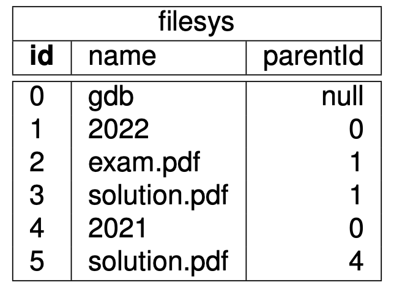
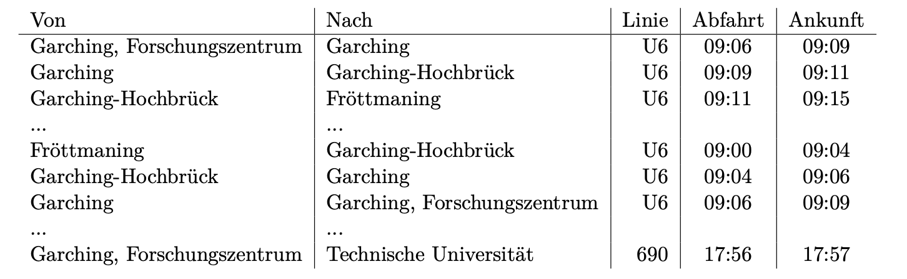

#### Hausaufgabe 1 SQL:Rekursion
Ein Dateisystem besteht aus Verzeichnissen und Dateien. Verzeichnisse können Dateien und (rekursiv) Verzeichnisse enthalten. Hier ein Ausschnitt der Relation filesys, die ein solches Dateisystem modelliert:



Jeder Eintrag im Dateisystem hat eine eindeutige id und einen Namen, der nicht eindeutig sein muss. Außer- dem haben Einträge das Attribut parentId, in dem die id des übergeordneten Verzeichnisses gespeichert ist.
8 9
Das Verzeichnis der obersten Ebene hat als parentId-Attribut den Wert null.
Das Verzeichnis gdb enthält hier beispielsweise das Unterverzeichnis 2022, in welchem die Klausur (exam.pdf) und die Musterlösung (solution.pdf) gespeichert sind.

**Formulieren Sie eine Anfrage, die für alle Einträge mit dem Namen *solution.pdf* den kompletten Dateipfad, beginnend mit „/“ ausgibt** (um die Klausurantworten auf dem Lehrstuhlserver zu leaken). Anbei finden Sie das erwartete Ergebnis für die Beispielausprägung. Ihre Anfrage muss natürlich auch dann funktionieren, wenn die Ausprägung der Relationen anders ist als die Beispielausprägung.
**Hinweis:** Mit dem „||“-Operator können Sie Zeichenketten verbinden:

    select 'hello' || '/' || 'world' -- ergibt 'hello/world'
    
```sql
with recursive TransitiverPfad as ( 
    select parent, '/' || name as pfad 
    from filesys
    where name = 'solution.pdf'
    union all
    select parent.parentId, '/' || parent.name || child.pfad 
    from TransitiverPfad child, filesys parent
    where child.parentId = parent.id
)
select pfad from TransitiverPfad where parentId is null
```

#### Hausaufgabe 2 Rekursion
Gegeben sei die Relation Fahrplan, die strukturell dem folgenden Beispiel gleicht:



Formulieren Sie die folgenden Anfragen auf diese Relation in SQL. Sie können die Typen TIME für Uhrzeiten und INTERVAL für Zeitintervalle verwenden. Schreiben Sie z.B. für 10:30 Uhr: TIME '10:30:00'. Das 0-Intervall kann z.B. so konstruiert werden: INTERVAL '00:00:00'.

2.1 Geben Sie eine Anfrage an, welche für alle Stationen ermittelt, welche anderen Stationen erreicht werden können. Beachten Sie, dass nur tatsächlich mögliche Verbindungen ausgegeben werden sollen, d.h. die Abfahrt an einer Haltestelle darf nicht vor der Ankunft liegen.
```sql
with recursive result as (
    select * from fahrplan 
    union all
    select f1.von, f2.nach, f1.linie, f1.abfahrt, f2.ankunft
    from result f1, fahrplan f2
    where f1.nach = f2.von 
    and f1.von != f2.nach 
    and f1.ankunft<=f2.abfahrt
)
select * from result;
```
2.2 Erweitern Sie ihre Anfrage aus Teilaufgabe a), sodass zusätzlich die summierte Fahrtzeit und Wartezeit sowie die gesamte Reisezeit ausgegeben wird. Die Fahrtzeit ist dabei nur die Zeit, in der man sich in einem Verkehrsmittel befindet. Die Wartezeit ist die Zeit, die bei einem Umstieg zwischen Ankunft des alten und Abfahrt des neuen Verkehrsmittels vergeht. Die Reisezeit ist die Zeit zwischen Abfahrt des ersten und Ankunft des letzen Verkehrsmittels.
```sql
with recursive result as (
    select *, ankunft-abfahrt as fahrzeit, interval '00:00:00' as wartezeit 
    from fahrplan 
    union all
    select f1.von, f2.nach, f1.linie, f1.abfahrt, f2.ankunft, 
           f1.fahrzeit + f2.ankunft-f2.abfahrt, 
           f1.wartezeit + f2.abfahrt-f1.ankunft
    from result f1, fahrplan f2
    where f1.nach = f2.von 
    and f1.von != f2.nach 
    and f1.ankunft<=f2.abfahrt
)
select *, fahrzeit+wartezeit as reisezeit from result;
```
2.3 Erweitern Sie ihre Anfrage aus Teilaufgabe a) oder b) nochmals und geben Sie die Anzahl der Umstiege für jede Verbindung aus.
```sql
with recursive result as (
select *, ankunft-abfahrt as fahrzeit, interval '00:00:00' wartezeit, 0 as umstiege
from fahrplan
union all
select f1.von, f2.nach, f2.linie, f1.abfahrt, f2.ankunft,
       f1.fahrzeit + f2.ankunft - f2.abfahrt, 
       f1.wartezeit + f2.abfahrt - f1.ankunft,
       f1.umstiege + case when f1.linie!=f2.linie or f1.ankunft<f2.abfahrt 
       then 1 else 0 end
from result f1, fahrplan f2
where f1.nach=f2.von 
and f1.von!=f2.nach 
and f1.ankunft<=f2.abfahrt
)
select *, fahrzeit + wartezeit as reisezeit from result
```
2.4 Finden Sie die „guten“ Verbindungen, um von Fröttmaning pünktlich zur Vorlesung „Grundlagen: Datenbanken“ um 10:30 Uhr zu kommen. Verwenden Sie dazu Ihre Anfrage aus Teilaufgabe c). Eine Verbindung ist „gut“, wenn sie spätestens um 10:30 in „Garching, Forschungszentrum“ ist und es keine andere Verbindung gibt, die später abfährt aber noch rechtzeitig eintrifft, deren Reisezeit geringer ist und bei der man weniger Umstiege hat.
```sql
with recursive result1 as (
select *, ankunft-abfahrt as fahrzeit, interval '00:00:00' as wartezeit, 0 as umstiege
from fahrplan
union all
select f1.von, f2.nach, f2.linie, f1.abfahrt, f2.ankunft,
       f1.fahrzeit+f2.ankunft-f2.abfahrt, 
       f1.wartezeit+f2.abfahrt-f1.ankunft,
       f1.umstiege+case when f1.linie!=f2.linie or f1.ankunft<f2.abfahrt 
       then 1 else 0 end
from result1 f1, fahrplan f2
where f1.nach=f2.von 
and f1.von!=f2.nach 
and f1.ankunft<=f2.abfahrt
),
result2 as (
select *, fahrzeit+wartezeit as reisezeit from result1
)

select * from result2 r1 
where r1.von = 'Fröttmaning' 
and r1.nach = 'Garching, Forschungszentrum' 
and r1.ankunft <= TIME '10:30:00' 
and not exists (
select * from result2 r2 
    where r2.von = r1.von 
    and r2.nach = r1.nach 
    and r2.ankunft <= TIME '10:30:00' 
    and r2.abfahrt > r1.abfahrt 
    and r2.reisezeit < r1.reisezeit 
    and r2.umstiege < r1.umstiege
);
```
